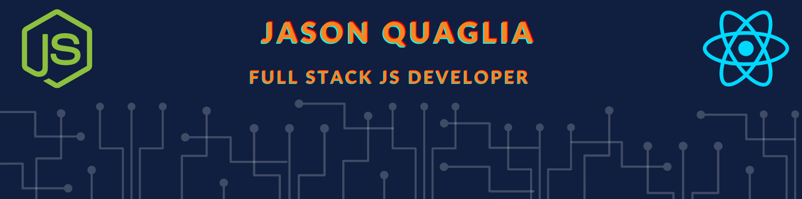

    &nbsp;&nbsp;
    &nbsp;&nbsp;
    

---

### 🤓 &nbsp;&nbsp;Who am I?

I'm a JavaScript Developer with a background in the Customer Service Industry. I am passionate about creathing a better world through customer-first software using agile methodologies. I'm continuously looking for new development challenges.

#### Pronouns: He / Him

---

### 👻 &nbsp;&nbsp;How and Why I Became a Developer

I had been trying to teach myself to program for a couple years but it wasn't until COVID-19 hit that I really devoted myself to it. I decided to attend an accelerated software development program with Code Fellows. It was here that I really fell in love with software.

The reason behind my motivation is pretty simple. I, of course, want to build a better life for family, friends, and those around me but on a personal level, I am tired of living in a world where the rules are decided by others. I want to become one of the creators that shape how society interacts with one another. I want to create and foster a world that everyone wants to live and thrive in. I believe tech is one of the best ways to make an impact on society as a single person.

---

### 🛠  &nbsp;&nbsp;Tools and Technologoies

- **OS** : macOS, Windows, Ubuntu
- **Languages** : JavaScript, SQL, CSS, HTML, Bash, Markdown
- **Tools** : Node.js, Express, React, React Native, Jest, Git, Github, VS Code, NPM, Yarn, Agile, REST, Heroku, AWS, AWS EC2, AWS S3, Socket.io, Web Sockets, Superagent, Expo, EJS, jQuery, Mustache, PostgreSQL, MongoDB, Regex, CDN, Gatsby

---

### 🌟  &nbsp;&nbsp;Professional Competencies

- Growth Mindset:

  - I've always followed my curiosity to dig deeper and learn more.

  - I'm always learning and making 1% changes to better myself.

  - Diversity is the future to solving many of societies issues.

  - Always working hard to be a reliable contributor.

---

### 🏙 &nbsp;&nbsp;Companies I'm interested in

- [Signal](https://signal.org/en/)

- [Mozilla](https://www.mozilla.org/en-US/)

- [Linux](https://www.linuxfoundation.org/)

- [Protonmail](https://protonmail.com/)

---

### 💻 &nbsp;&nbsp;I'm currently learning / working on

- [Leetcode](https://leetcode.com/jquaglia/)

- [HackerRank](https://www.hackerrank.com/jqugali)

- [edX: CS50](https://www.edx.org/course/introduction-computer-science-harvardx-cs50x)

- [Udemy: React](https://www.udemy.com/course/modern-react-bootcamp/)

- [Udemy: DSA](https://www.udemy.com/course/js-algorithms-and-data-structures-masterclass/)

---

    

---

### 🚀  &nbsp;&nbsp;Things I'm interested in and want to learn more about

- Learning Languages 🇮🇹 🇭🇰

- Hardware ( semi-conductors )

- Building Keyboards/Computers

- Cryptocurrency

- Cryptography

- Foraging for food! 🍄

<!--
**jquaglia/jquaglia** is a ✨ _special_ ✨ repository because its `README.md` (this file) appears on your GitHub profile.

Here are some ideas to get you started:

- 🔭 I’m currently working on ...
- 🌱 I’m currently learning ...
- 👯 I’m looking to collaborate on ...
- 🤔 I’m looking for help with ...
- 💬 Ask me about ...
- 📫 How to reach me: ...
- 😄 Pronouns: ...
- ⚡ Fun fact: ...
-->
